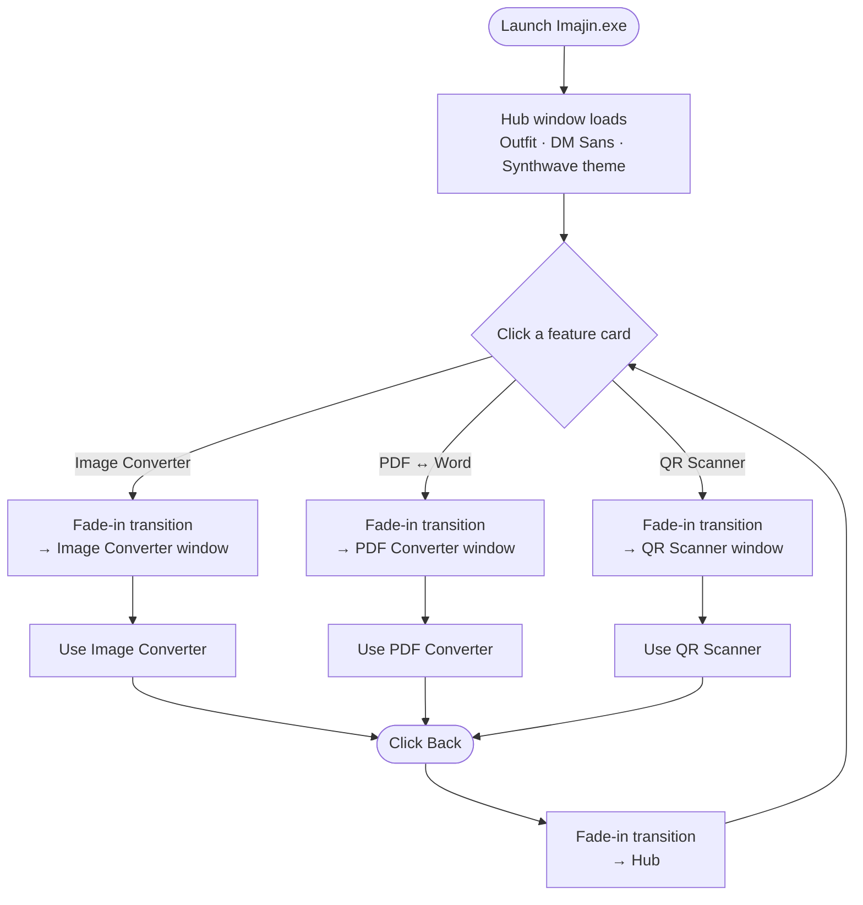

# User Flow — Hub (Home Screen)

```mermaid
flowchart TD
    A([Launch Imajin.exe]) --> B[Hub window loads\nOutfit · DM Sans · Synthwave theme]
    B --> C{Click a feature card}

    C -->|Image Converter| D[Fade-in transition\n→ Image Converter window]
    C -->|PDF ↔ Word| E[Fade-in transition\n→ PDF Converter window]
    C -->|QR Scanner| F[Fade-in transition\n→ QR Scanner window]

    D --> G[Use Image Converter]
    E --> H[Use PDF Converter]
    F --> I[Use QR Scanner]

    G --> J([Click Back])
    H --> J
    I --> J

    J --> K[Fade-in transition\n→ Hub]
    K --> C
```
