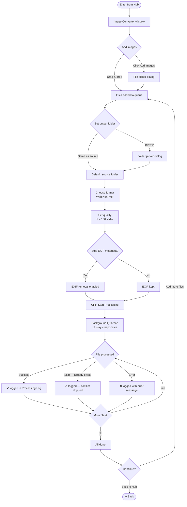

# User Flow — Image Converter

```mermaid
flowchart TD
    A([Enter from Hub]) --> B[Image Converter window]
    B --> C{Add images}
    C -->|Drag & drop| D[Files added to queue]
    C -->|Click Add Images| E[File picker dialog] --> D

    D --> F{Set output folder}
    F -->|Same as source| G[Default: source folder]
    F -->|Browse| H[Folder picker dialog] --> G

    G --> I[Choose format\nWebP or AVIF]
    I --> J[Set quality\n1 – 100 slider]
    J --> K{Strip EXIF metadata?}
    K -->|Yes| L[EXIF removal enabled]
    K -->|No| M[EXIF kept]

    L --> N[Click Start Processing]
    M --> N

    N --> O[Background QThread\nUI stays responsive]
    O --> P{File processed}
    P -->|Success| Q[✔ logged in Processing Log]
    P -->|Skip — already exists| R[⚠ logged — conflict skipped]
    P -->|Error| S[✖ logged with error message]

    Q --> T{More files?}
    R --> T
    S --> T
    T -->|Yes| P
    T -->|No| U[All done]

    U --> V{Continue?}
    V -->|Add more files| D
    V -->|Back to Hub| W([↩ Back])
```
