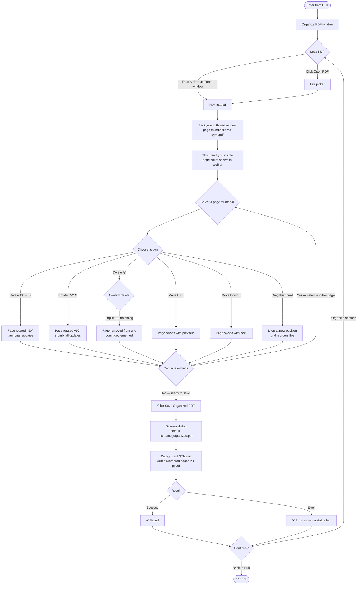

# User Flow — Organize PDF

```mermaid
flowchart TD
    A([Enter from Hub]) --> B[Organize PDF window]

    B --> C{Load PDF}
    C -->|Drag & drop .pdf onto window| D[PDF loaded]
    C -->|Click Open PDF| E[File picker] --> D

    D --> F[Background thread renders\npage thumbnails via pymupdf]
    F --> G[Thumbnail grid visible\npage count shown in toolbar]

    G --> H{Select a page thumbnail}

    H --> I{Choose action}

    I -->|Rotate CCW ↺| J[Page rotated –90°\nthumbnail updates]
    I -->|Rotate CW ↻| K[Page rotated +90°\nthumbnail updates]
    I -->|Delete 🗑| L{Confirm delete}
    L -->|Implicit — no dialog| M[Page removed from grid\ncount decremented]
    I -->|Move Up ↑| N[Page swaps with previous]
    I -->|Move Down ↓| O[Page swaps with next]
    I -->|Drag thumbnail| P[Drop at new position\ngrid reorders live]

    J --> Q{Continue editing?}
    K --> Q
    M --> Q
    N --> Q
    O --> Q
    P --> Q

    Q -->|Yes — select another page| H
    Q -->|No — ready to save| R[Click Save Organized PDF]

    R --> S[Save-as dialog\ndefault: filename_organized.pdf]
    S --> T[Background QThread\nwrites reordered pages via pypdf]
    T --> U{Result}
    U -->|Success| V[✔ Saved]
    U -->|Error| W[✖ Error shown in status bar]

    V --> X{Continue?}
    W --> X
    X -->|Organize another| C
    X -->|Back to Hub| Y([↩ Back])
```
