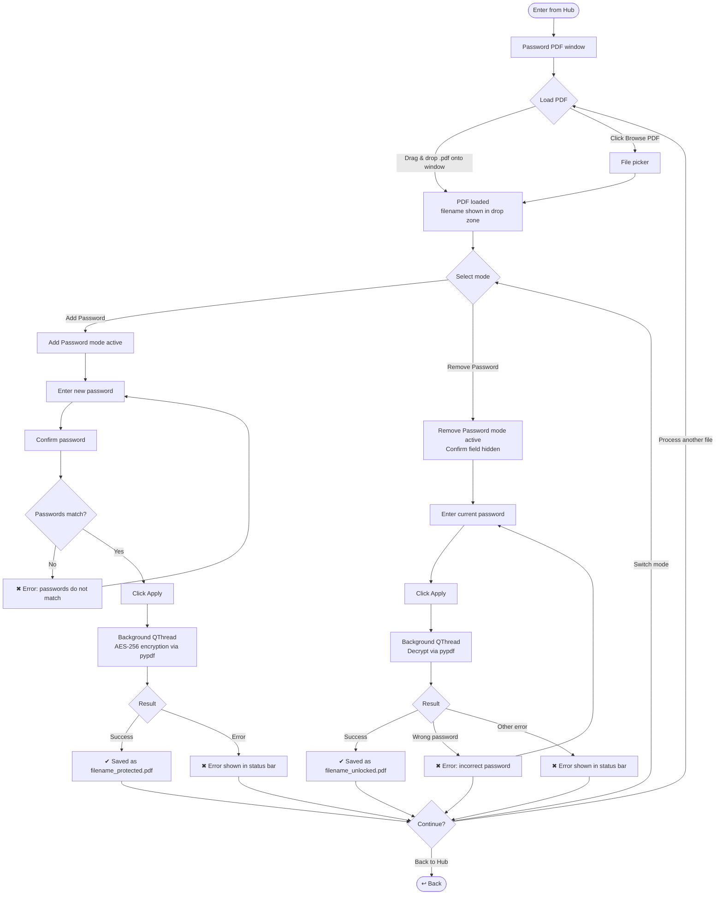

# User Flow — Password PDF

```mermaid
flowchart TD
    A([Enter from Hub]) --> B[Password PDF window]

    B --> C{Load PDF}
    C -->|Drag & drop .pdf onto window| D[PDF loaded\nfilename shown in drop zone]
    C -->|Click Browse PDF| E[File picker] --> D

    D --> F{Select mode}

    %% ── Add Password ─────────────────────────────────────────────────
    F -->|Add Password| G[Add Password mode active]
    G --> H[Enter new password]
    H --> I[Confirm password]
    I --> J{Passwords match?}
    J -->|No| K[✖ Error: passwords do not match] --> H
    J -->|Yes| L[Click Apply]
    L --> M[Background QThread\nAES-256 encryption via pypdf]
    M --> N{Result}
    N -->|Success| O[✔ Saved as filename_protected.pdf]
    N -->|Error| P[✖ Error shown in status bar]

    %% ── Remove Password ──────────────────────────────────────────────
    F -->|Remove Password| Q[Remove Password mode active\nConfirm field hidden]
    Q --> R[Enter current password]
    R --> S[Click Apply]
    S --> T[Background QThread\nDecrypt via pypdf]
    T --> U{Result}
    U -->|Success| V[✔ Saved as filename_unlocked.pdf]
    U -->|Wrong password| W[✖ Error: incorrect password] --> R
    U -->|Other error| X[✖ Error shown in status bar]

    O --> Y{Continue?}
    P --> Y
    V --> Y
    W --> Y
    X --> Y
    Y -->|Process another file| C
    Y -->|Switch mode| F
    Y -->|Back to Hub| Z([↩ Back])
```
