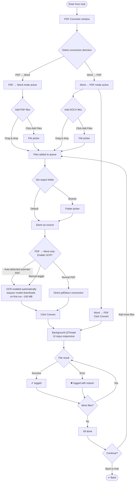

# User Flow — PDF ↔ Word Converter

```mermaid
flowchart TD
    A([Enter from Hub]) --> B[PDF Converter window]
    B --> C{Select conversion direction}

    C -->|PDF → Word| D[PDF → Word mode active]
    C -->|Word → PDF| E[Word → PDF mode active]

    D --> F{Add PDF files}
    F -->|Drag & drop| G[Files added to queue]
    F -->|Click Add Files| H[File picker] --> G

    E --> I{Add DOCX files}
    I -->|Drag & drop| G
    I -->|Click Add Files| J[File picker] --> G

    G --> K{Set output folder}
    K -->|Default| L[Same as source]
    K -->|Browse| M[Folder picker] --> L

    L --> N{PDF → Word only:\nEnable OCR?}
    N -->|Auto-detected scanned PDF| O[OCR enabled automatically\neasyocr model downloads on first run ~100 MB]
    N -->|Normal PDF| P[Direct pdf2docx conversion]
    N -->|Manual toggle| O

    O --> Q[Click Convert]
    P --> Q

    E --> Q2[Word → PDF\nClick Convert]

    Q --> R[Background QThread\nUI stays responsive]
    Q2 --> R

    R --> S{File result}
    S -->|Success| T[✔ logged]
    S -->|Error| U[✖ logged with reason]

    T --> V{More files?}
    U --> V
    V -->|Yes| S
    V -->|No| W[All done]

    W --> X{Continue?}
    X -->|Add more files| G
    X -->|Back to Hub| Y([↩ Back])
```

> **Note:** Word → PDF requires Microsoft Word to be installed and licensed.
