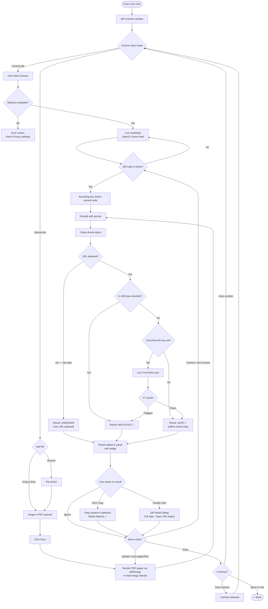

# User Flow — QR Scanner

> **VirusTotal** — optional. Add your API key in the Settings panel (right side) to enable live scanning beyond the offline URLhaus blocklist.  
> **PDF scanning** — requires Poppler for Windows on the system `PATH`.
