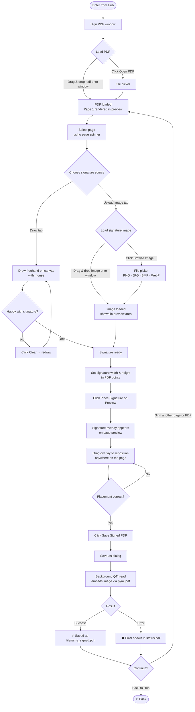

# User Flow — Sign PDF

```mermaid
flowchart TD
    A([Enter from Hub]) --> B[Sign PDF window]

    B --> C{Load PDF}
    C -->|Drag & drop .pdf onto window| D[PDF loaded\nPage 1 rendered in preview]
    C -->|Click Open PDF| E[File picker] --> D

    D --> F[Select page\nusing page spinner]
    F --> G{Choose signature source}

    %% ── Draw tab ─────────────────────────────────────────────────────
    G -->|Draw tab| H[Draw freehand on canvas\nwith mouse]
    H --> I{Happy with signature?}
    I -->|No| J[Click Clear → redraw] --> H
    I -->|Yes| K[Signature ready]

    %% ── Upload Image tab ─────────────────────────────────────────────
    G -->|Upload Image tab| L{Load signature image}
    L -->|Drag & drop image onto window| M[Image loaded\nshown in preview area]
    L -->|Click Browse Image…| N[File picker\nPNG · JPG · BMP · WebP] --> M
    M --> K

    %% ── Placement ───────────────────────────────────────────────────
    K --> O[Set signature width & height\nin PDF points]
    O --> P[Click Place Signature on Preview]
    P --> Q[Signature overlay appears\non page preview]
    Q --> R[Drag overlay to reposition\nanywhere on the page]
    R --> S{Placement correct?}
    S -->|No| R
    S -->|Yes| T[Click Save Signed PDF]

    T --> U[Save-as dialog]
    U --> V[Background QThread\nembeds image via pymupdf]
    V --> W{Result}
    W -->|Success| X[✔ Saved as filename_signed.pdf]
    W -->|Error| Y[✖ Error shown in status bar]

    X --> Z{Continue?}
    Y --> Z
    Z -->|Sign another page or PDF| D
    Z -->|Back to Hub| AA([↩ Back])
```
