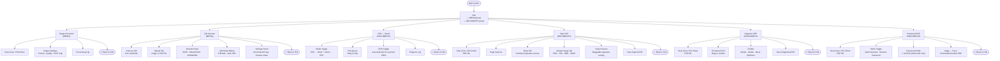

# Imajin — Site Map

```mermaid
graph TD
    Launch([App Launch]) --> Hub

    Hub["Hub\n― MEDIA group\n― DOCUMENTS group"]

    %% ── MEDIA ───────────────────────────────────────────────────────────
    Hub --> IC["Image Converter\n(MEDIA)"]
    Hub --> QR["QR Scanner\n(MEDIA)"]

    IC --> IC_Drop["Drop Zone / File Picker"]
    IC --> IC_Settings["Output Settings\nFormat · Quality · EXIF strip"]
    IC --> IC_Log["Processing Log"]
    IC --> IC_Back(["↩ Back to Hub"])

    QR --> QR_Camera["Camera Tab\nLive viewfinder"]
    QR --> QR_Upload["Upload Tab\nImage or PDF file"]
    QR --> QR_Results["Results Panel\nSAFE · MALICIOUS · UNKNOWN"]
    QR --> QR_Dialog["QR Detail Dialog\nFull data · open URL"]
    QR --> QR_Settings["Settings Panel\nVirusTotal API key · Camera index"]
    QR --> QR_Back(["↩ Back to Hub"])

    %% ── DOCUMENTS ───────────────────────────────────────────────────────
    Hub --> PDF["PDF ↔ Word\n(DOCUMENTS)"]
    Hub --> Sign["Sign PDF\n(DOCUMENTS)"]
    Hub --> Org["Organize PDF\n(DOCUMENTS)"]
    Hub --> Pw["Password PDF\n(DOCUMENTS)"]

    PDF --> PDF_Mode["Mode Toggle\nPDF → Word  /  Word → PDF"]
    PDF --> PDF_Queue["File Queue\nDrag & drop"]
    PDF --> PDF_OCR["OCR Toggle\nauto-detected for scanned PDFs"]
    PDF --> PDF_Log["Progress Log"]
    PDF --> PDF_Back(["↩ Back to Hub"])

    Sign --> Sign_Drop["Drop Zone / File Picker\nPDF file"]
    Sign --> Sign_Page["Page Selector"]
    Sign --> Sign_Draw["Draw Tab\nFreehand signature canvas"]
    Sign --> Sign_Upload["Upload Image Tab\nPNG · JPG · BMP · WebP"]
    Sign --> Sign_Preview["Page Preview\nDraggable signature overlay"]
    Sign --> Sign_Save["Save Signed PDF"]
    Sign --> Sign_Back(["↩ Back to Hub"])

    Org --> Org_Drop["Drop Zone / File Picker\nPDF file"]
    Org --> Org_Grid["Thumbnail Grid\nDrag-to-reorder"]
    Org --> Org_Tools["Toolbar\nRotate · Delete · Move Up/Down"]
    Org --> Org_Save["Save Organized PDF"]
    Org --> Org_Back(["↩ Back to Hub"])

    Pw --> Pw_Drop["Drop Zone / File Picker\nPDF file"]
    Pw --> Pw_Mode["Mode Toggle\nAdd Password · Remove Password"]
    Pw --> Pw_Fields["Password Fields\n+ Confirm (Add mode only)"]
    Pw --> Pw_Save["Apply → Save Protected/Unlocked PDF"]
    Pw --> Pw_Back(["↩ Back to Hub"])
```
