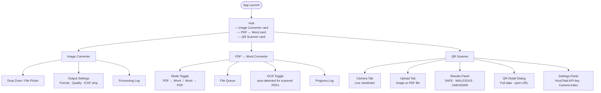

# Imajin — Site Map

```mermaid
graph TD
    Launch([App Launch]) --> Hub

    Hub["Hub\n― Image Converter card\n― PDF ↔ Word card\n― QR Scanner card"]

    Hub --> IC["Image Converter"]
    Hub --> PDF["PDF ↔ Word Converter"]
    Hub --> QR["QR Scanner"]

    IC --> IC_Drop["Drop Zone / File Picker"]
    IC --> IC_Settings["Output Settings\nFormat · Quality · EXIF strip"]
    IC --> IC_Log["Processing Log"]


    PDF --> PDF_Mode["Mode Toggle\nPDF → Word  /  Word → PDF"]
    PDF --> PDF_Queue["File Queue"]
    PDF --> PDF_OCR["OCR Toggle\nauto-detected for scanned PDFs"]
    PDF --> PDF_Log["Progress Log"]


    QR --> QR_Camera["Camera Tab\nLive viewfinder"]
    QR --> QR_Upload["Upload Tab\nImage or PDF file"]
    QR --> QR_Results["Results Panel\nSAFE · MALICIOUS · UNKNOWN"]
    QR --> QR_Dialog["QR Detail Dialog\nFull data · open URL"]
    QR --> QR_Settings["Settings Panel\nVirusTotal API key · Camera index"]

```
